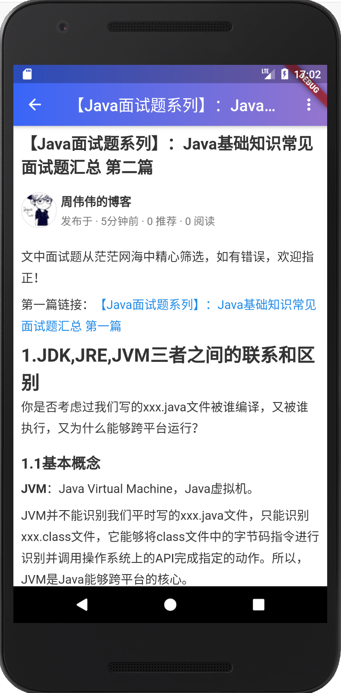

# Flutter版 博客园第三方 App.

如何疑问或BUG 请提 Issue

### 注意

访问博客园API需要申请API KEY,[申请地址](https://oauth.cnblogs.com/)

为了下载项目后能直接运行,已经设置了默认的Key,请申请成功后替换自己的Key.

## App目录结构
>- |--android
>- |--assets (静态资源文件)
>- |--build (编译文件)
>- |--ios
>- |--lib
>    - |-- blocs 
>    - |-- common (公共类，帮助类，例如常量Constant)
>    - |-- components (组件)
>    - |-- model (实体)
>    - |-- pages (界面相关)
>    - |-- resources (资源，strings，colors)
>    - |-- services (服务层)
>    - |-- utils (工具)
>    - |-- widgets (部件，webview,loading,refresh,item ...)
>- |--test

### 网络数据

本项目使用 Dio 进行网络请求。具体实现在 utils --> http_util

```dart
class HttpUtil {
  Dio _dio;
  Dio _tokenDio;
  BaseOptions options;
  static final _baseUrl = AppConfig.host;
  static final _jsonContentType = ContentType.parse("application/json");
  static final _formContentType =
      ContentType.parse("application/x-www-form-urlencoded");

  // 工厂模式
  factory HttpUtil() => _getInstance();
  static HttpUtil get instance => _getInstance();
  static HttpUtil _instance;

  static HttpUtil _getInstance() {
    if (_instance == null) {
      _instance = new HttpUtil._internal();
    }
    return _instance;
  }

  HttpUtil._internal() {
    // 初始化
    options = BaseOptions(
        baseUrl: _baseUrl,
        connectTimeout: 10000,
        receiveTimeout: 5000,
        headers: {},
        followRedirects: true);
    _dio = new Dio(options);
    _tokenDio = new Dio(options);

    //拦截器
    _dio.interceptors
        .add(InterceptorsWrapper(onRequest: (RequestOptions options) {
      // 在请求被发送之前做一些事情
      if (options.path.startsWith("token")) {
        return options;
      }

      var sptokenModel = SpHelper.getObject<TokenModel>(CacheKey.access_token);
      if (sptokenModel == null ||sptokenModel.access_token==null) {
        _dio.interceptors.requestLock.lock();

        Map<String, String> map = new Map();
        map['grant_type'] = 'client_credentials';
        map['client_id'] = AppConfig.clientId;
        map['client_secret'] = AppConfig.clientSecret;

        var option = new Options(contentType: _formContentType);
        return _tokenDio
            .post(AppConfig.clientToken, data: map, options: option)
            .then((result) {
          var tokenModel = TokenModel.fromJson(result.data);
          if (tokenModel != null) {
            SpHelper.setObject(CacheKey.access_token, tokenModel.toJson());
          }

          options.headers["Authorization"] = 'Bearer ${tokenModel.access_token}';
          return options;
        }).whenComplete(
                () => _dio.interceptors.requestLock.unlock()); // unlock the dio

      } else {
        options.headers["Authorization"] = 'Bearer ${sptokenModel.access_token}';
        return options; //continue
      }

      // 如果你想完成请求并返回一些自定义数据，可以返回一个`Response`对象或返回`dio.resolve(data)`。
      // 这样请求将会被终止，上层then会被调用，then中返回的数据将是你的自定义数据data.
      //
      // 如果你想终止请求并触发一个错误,你可以返回一个`DioError`对象，或返回`dio.reject(errMsg)`，
      // 这样请求将被中止并触发异常，上层catchError会被调用。
    }, onResponse: (Response response) {
      // 在返回响应数据之前做一些预处理
      return response; // continue
    }, onError: (DioError e) {
      // 当请求失败时做一些预处理
      return e; //continue
    }));
    
    .......
  }

```

## 说明

文章的详情展示，由于API 返回的不是完整的页面Url，只是文章内容，无法直接用WebView 展示，故自己写了静态html，将内容通过Vue的方式 绑定到页面展示。

又由于静态的html 无法加载样式与JavaScript ,我在其App 内部开启一个web服务器。核心代码如下：

```dart
void main() async {
  //开启本地web服务。用于加载样式
  final server = Jaguar();
  server.addRoute(serveFlutterAssets());
  await server.serve(logRequests: true);
  server.log.onRecord.listen((r) => print(r));
  // end web server
  
  
  runApp(BlocProvider<ApplicationBloc>(
    bloc: ApplicationBloc(),
    child: MyApp()//BlocProvider(child: MyApp(), bloc: HomeBloc()),
  ));
}

```

html 部分

```html
<html>
<head>
    <meta name="viewport" content="width=device-width, initial-scale=1.0, maximum-scale=1.0,minimum-scale=1.0, user-scalable=no" />
    <link rel="stylesheet" type="text/css" href="http://127.0.0.1:8080/css/default.css" />
    <script type="text/javascript" src="http://127.0.0.1:8080/js/jquery.min.js"></script>
    <script type="text/javascript" src="http://127.0.0.1:8080/js/vue.min.js"></script>
</head>
<body>
    <div id="app" v-cloak v-show="hasContent">
        <h2 class="title">{{ model.title }}</h2>
        <div class="authorinfo">
            <div class="authorInfo-content">
                <span class="authorInfo-time">
                    发布于 · {{ model.dateDisplay }} · {{ model.diggCount }} 推荐 · {{ model.viewCount }} 阅读
                </span>
            </div>
        </div>
        <div class="content" v-html="model.body"></div>
        <div class="comments">
            <div class="comment-header">
                <div class="line"></div>
                <div class="comment">所有评论</div>
                <div class="line">
                </div>
            </div>
            <section v-for="item in comments">
                <div class="comments-item">
                    <span class="item-avatar"></span>
                    <div class="item-authorInfo">
                        <span class="item-name">{{ item.userName }}</span>
                        <div class="item-content" v-html="item.commentContent"></div>
                        <div class="item-actions">
                            <span class="item-time">{{ item.dateDisplay }}</span>
                            <div class="item-edit" v-if="item.IsLoginUser">
                                
                                
                                
                            </div>
                        </div>
                        <span class="item-line"></span>
                    </div>
                </div>
            </section>
        </div>
        <div class="footer">
            <div class="loading" v-if="loadStatus == 0||loadStatus == 1">
                <span class="loading-content">正在加载中</span>
            </div>
            <div class="nodata" v-else-if="loadStatus == 2">
                - 还没有评论 -
            </div>
            <div class="nodata" v-else-if="loadStatus == 3">
                - 没有更多评论了 -
            </div>
            <div class="error" v-else-if="loadStatus === 4||loadStatus === 5">
                <span class="error-content">好像出现了问题</span>
                <a href="javascript:void(0)" class="error-btn" v-on:click="reload">重新加载</a>
            </div>
        </div>
    </div>
    <script>
        var app = new Vue({
            el: '#app',
            data: {
                hasContent: false,
                model: {},
                loadStatus: 0,
                comments: []
            },
            methods: {
                reload: function () {
                    this.loadStatus = 1;
                    flutterReload.postMessage("123");
                },
                editItem: function (item) {
                    editItem(item.CommentID);
                },
                deleteItem: function (item) {
                    item.IsDelete = true;
                    deleteItem(item.CommentID);
                }
            }
        });
        $(window).scroll(function () {
            loadReload();
        });
        function scrollToComments() {
            if (app.hasContent) {
                $("html,body").animate({ scrollTop: $(".comments").offset().top }, 1000);
            }
        }
        function loadReload() {
            if ($(document).scrollTop() + window.screen.height + 70 >= $(document).height()) {
                if (app.loadStatus == 0 || app.loadStatus == 2){
                     flutterReload.postMessage("123");
                }
            }
        }
        function updateModel(model) {
            if (!app.hasContent) {
                app.hasContent = true;
                loadReload();
            }
            app.model = model;
        }
        function updateLoadStatus(loadStatus) {
            app.loadStatus = loadStatus;
        }
        function updateComments(list) {
            app.comments = app.comments.concat(list)
        }
        function updateComment(item) {
            var b = true;
            if (item.CommentID > 0) {
                for (var i = 0; i < app.comments.length; i++) {
                    var element = app.comments[i];
                    if (element.CommentID == item.CommentID) {
                        b = false;
                        element = item;
                    }
                }
            }
            if (b) {
                app.comments = app.comments.concat(item);
            }
        }
        function deleteComment(id, isTrue) {
            for (var i = 0; i < app.comments.length; i++) {
                var element = app.comments[i];
                if (element.CommentID == id) {
                    element.IsDelete = isTrue;
                    if (isTrue) {
                        app.comments = app.comments.splice(i, 1);
                    }
                }
            }
        }
    </script>
</body>
</html>

```
### Flutter 国际化相关 [fluintl](https://github.com/Sky24n/fluintl)
fluintl是一个为应用提供国际化的库，可快速集成实现应用多语言。该库封装了一个国际化支持类，通过提供统一方法getString(id)获取字符串。
```dart
// 在MyApp initState配置多语言资源
setLocalizedValues(localizedValues); //配置多语言资源
// 在MaterialApp指定localizationsDelegates和supportedLocales
MaterialApp(  
   home: MyHomePage(),  
   localizationsDelegates: [  
   GlobalMaterialLocalizations.delegate,  
   GlobalWidgetsLocalizations.delegate,  
   CustomLocalizations.delegate //设置本地化代理     
   ],  
   supportedLocales: CustomLocalizations.supportedLocales,//设置支持本地化语言集合     
); 
// 字符串获取
IntlUtil.getString(context, Ids.titleHome);

```

# 关于Android版

## 截图





# 关于IOS版

太穷，买不起Mac, 没有环境，跑不起来 emmmmmm......嘤嘤嘤~~~

## 联系我

Email：[wirehomedev@gmail.com](mailto:wirehomedev@gmail.com)
GitHub: [https://github.com/doCore](https://github.com/doCore)
简书: [https://www.jianshu.com/u/7262f4954b26](https://www.jianshu.com/u/7262f4954b26)
知乎: [https://www.zhihu.com/people/wirehome/activities](https://www.zhihu.com/people/wirehome/activities)


# 如果你不再恐惧，你会做什么？